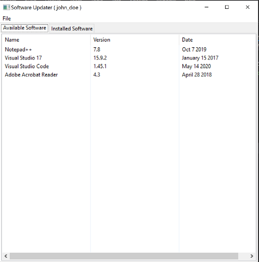

# Software Updater Tool

This is a repo for the capstone project in Udacity C++ Nanodegree Program.  The Capstone chosen here gives a chance to practice the knowledge of
C++ programming language gained during the course of the Nanodegree program.

This project simulates the functionality of a simple Software Updator tool. Many organizations use such tools to allow users to search, install
and manage tools provided by the organization for day-to-day activities ex. Microsoft Teams, Log analysis tools, IDEs etc.

# Dependencies

* cmake >= 3.11
* make >= 4.1 (Linux), 3.81 (Windows)
* gcc/g++ >= 5.4
* wxWidgets >= 3.0
	* Linux: `sudo apt-get install sudo apt-get install libwxgtk3.0-dev libwxgtk3.0-0v5-dbg`
	* Windows: Installation instruction can be found [here](https://wiki.wxwidgets.org/Install)

# Instructions for building the project

1. Clone the repo
2. Make a build directory in the top level directory: `mkdir build && cd build`.
3. Compile the code by running: `cmake .. && make`

# Instructions for running the project

* After completing the build process run the executable
	* `./SoftwareUpdater`

* The first screen to get displayed is the login screen which will prompt to enter a username
	* Fill in the text box with the username ex. john_doe
	* The username is accepted by either hitting the `Return` key or clicking the provided "OK" button
	* Another button has been provided to allow the user to quit the application
	
	* 
	
* The next window after username input is provided displays two tabbed panes showing the softwares currently "available" for installation and the softwares that have been "installed"
	
	* 
	
	* 
	
* Software installation is simulated when the user clicks on one of the displayed items. Clicking the list item will move the software from "available list" to "installed list"

	* 
	
	* 
	
* Similarly software removal is simulated by clicking one of the list items in the "installed softwares" tab. Doing so will move the software out of the installed list back into available list

	* 
	
	* 
	
* Closing the program will update the current state of available and installed softwares into corresponding files

* The next launch of the application will present the data based on the previous saved state

# Overview of code structure

The project is implemented using Object Oriented design methodologies. The class names and their description is provided below

Class                | Description
-------------------- | -----------------------------------------------------------------------------------------------------------------
Software             | Defines a software object encapsulating details like name, version and data of publishing 
SoftwareInfoManager  | File management object to manage the underlying source of data for tracking available and installed softwares
SoftwareUpdater      | Main object which stores the software information read from the file into memory and interacts with GUI
SoftwareUpdaterGui   | The GUI for the SoftwareUpdater application which also includes the entry point for the app

# Project rubric

* README included with the project
* Submission compiles and runs successfully
* Loops, Functions, I/O
	* The program demonstrates an understanding of C++ functions and control sturctures
	* The project code is organized into well defined functions
	* The program accepts inputs from the user and takes the necessary actions
	* Information required for the functionality of the program is read from an external file
	* Exiting the program also writes the information back into the file to be used in the next launch
* Object oriented programming
	* The project uses Object Oriented Programming techniques
	* Classes use appropriate access specifiers for members
	* Class constructors utilize member initialization lists
	* Classes encapsulate behavior
	* Wherever needed classes inherit from other base classes ex. GUI componenets
* Memory management
	* The project uses references in function declerations as required
	* The project follows the rule of 5 for atleast one of the classes
	* The project uses both raw pointers (for GUI components) and smart pointers
* Concurrency
	* Async tasks and future references were used to update the information in memory and display the contents in GUI correctly
